# Fixation generator

The capabilities of the generator are presented below. In general, given fixation target parameters the generator will create and save an image of the fixation target.

The generator currently supports shapes presented in [Thaler et al., 2013](https://doi.org/10.1016/j.visres.2012.10.012).

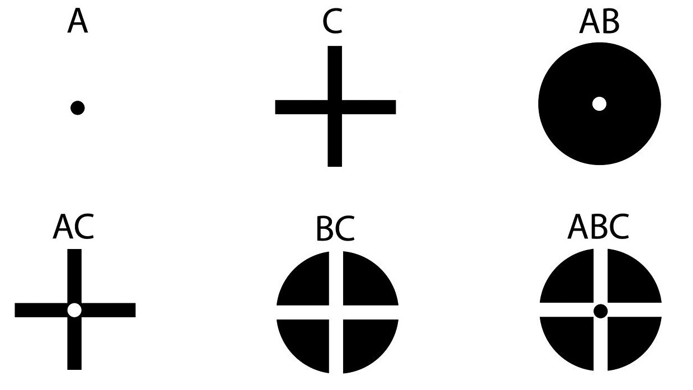

## Usage
### Import the generator class
```matlab
import CFSVM.FixationGenerator
```

### Initialize the generator object
The arguments of the object constructor are as follows: first, path to the parent directory in which will be created the `Fixation/` folder. The generated fixation target will be saved inside this folder. Next, the **radius** argument describes the radius in pixels of the largest shape in the fixation, e.g., radius of the big circle in the "AB" shape or half-width of the cross in "AC" shape, the final image resolution will be (radius\*2+1, radius\*2+1). I suggest using a minimum 128 pixels and resizing it later in the experiment run, instead of generating an image with low resolution.

After that, the **hex_color** sets the color of the fixation target. If you'd like to smooth the edges of the image, set **is_smooth_edges** to `true` and **smoothing_cycles** to some positive integer (the greater the number, the smoother edges will be).

No smoothing, radius 64 pixels|No smoothing, radius 256 pixels|With 5 smoothing cycles, radius 256 pixels
:-------------------------:|:-------------------------:|:-------------------------:
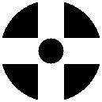 |  | 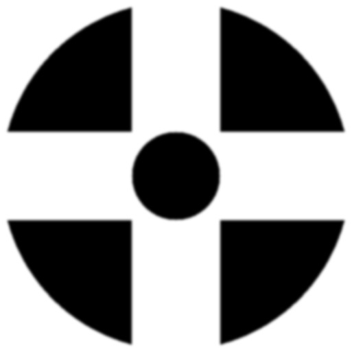

```matlab
gen = FixationGenerator( ...
    '../Stimuli/', ...
    radius=256, ...
    hex_color='#000000', ...
    is_smooth_edges=true, ...
    smoothing_cycles=5);
```

### Generate fixation target
There is a method for every available shape with additional shape-specific arguments. After running, for example, `gen.A(fname=fixation.png)` or `gen.ABC(cross_width=64, inner_circle_radius=64, fname='fixation')`, an image of shape A or ABC, respectively, will be generated and saved as `../Stimuli/Fixation/fixation.png`.

### Shapes gallery
The following images were smoothed with 5 cycles.
`gen.C(cross_width=32)`|`gen.C(cross_width=64)`|`gen.C(cross_width=96)`
:-------------------------:|:-------------------------:|:-------------------------:
 |  | 
`gen.AB(inner_circle_radius=32)`|`gen.AB(inner_circle_radius=64)`|`gen.AB(inner_circle_radius=96)`
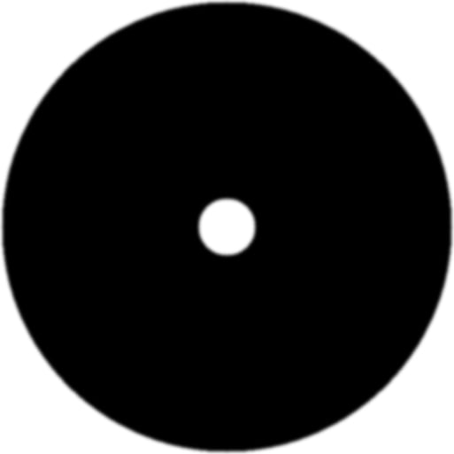 | 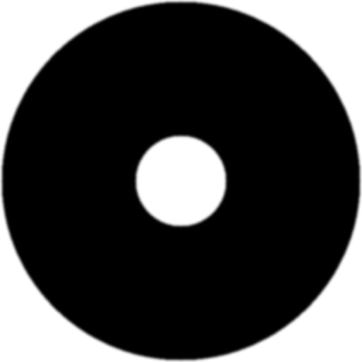 | 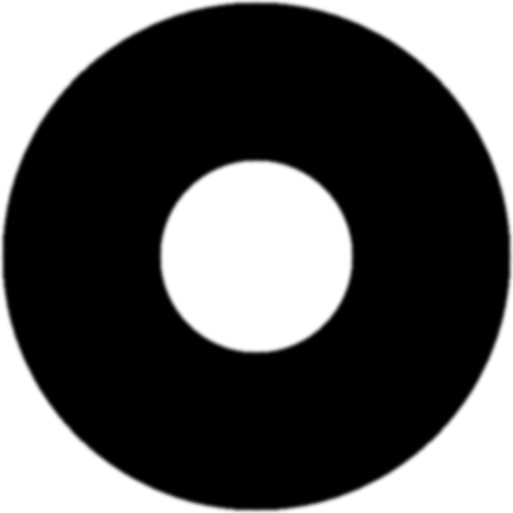
`gen.AC(cross_width=32, circle_radius=32)`|`gen.AC(cross_width=64, circle_radius=64)`|`gen.AC(cross_width=96, circle_radius=96)`
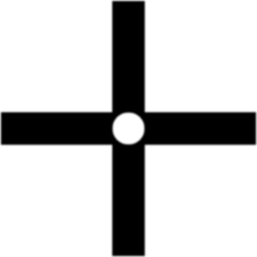 | 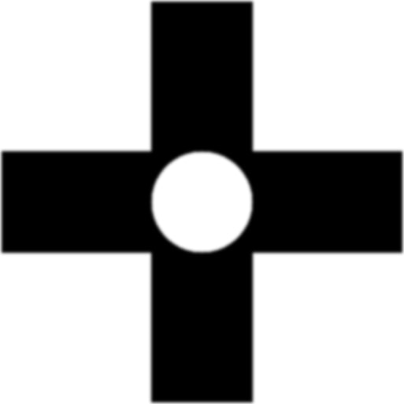 | 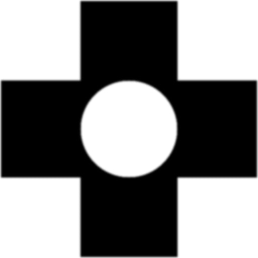
`gen.BC(cross_width=32)`|`gen.BC(cross_width=64)`|`gen.BC(cross_width=96)`
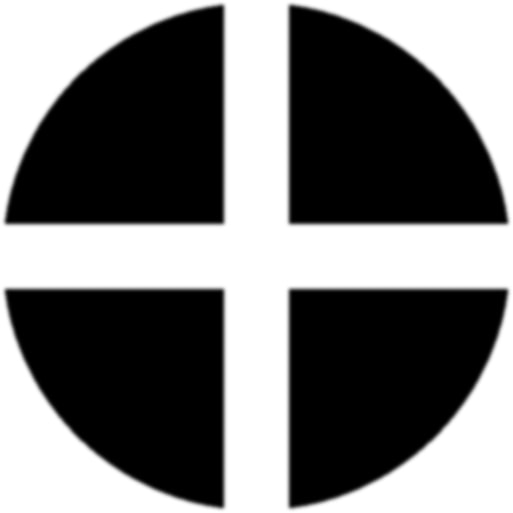 | 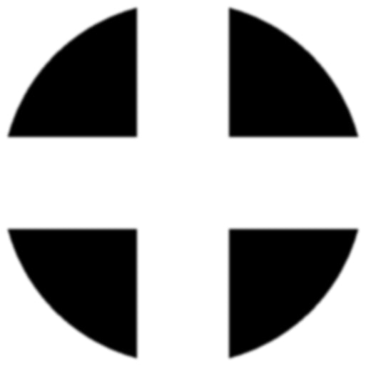 | 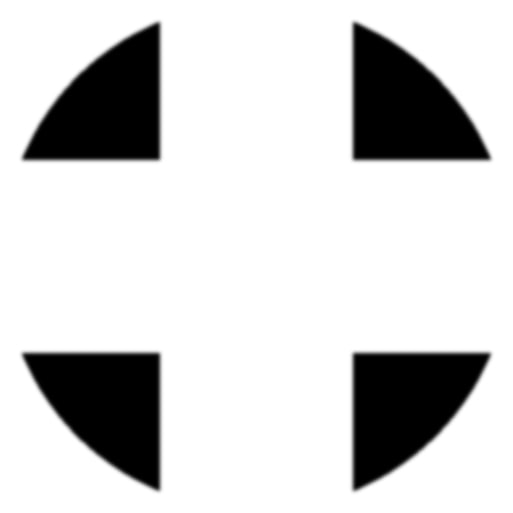
`gen.ABC(cross_width=32, inner_circle_radius=32)`|`gen.ABC(cross_width=64, inner_circle_radius=64)`|`gen.ABC(cross_width=96, inner_circle_radius=96)`
 | 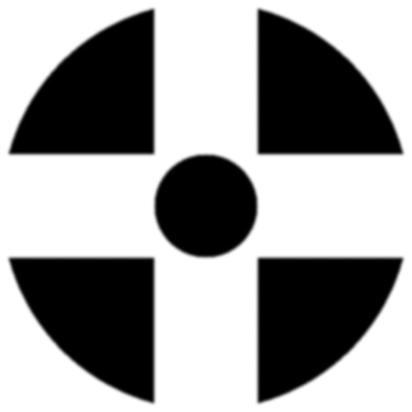 | 


